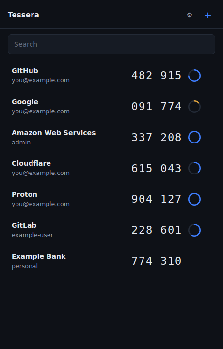
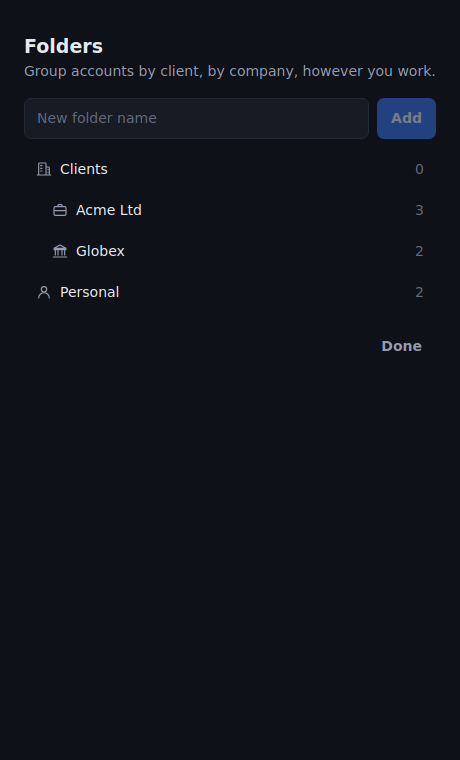
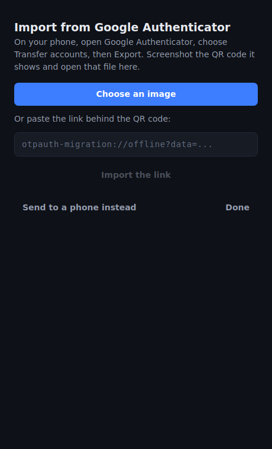
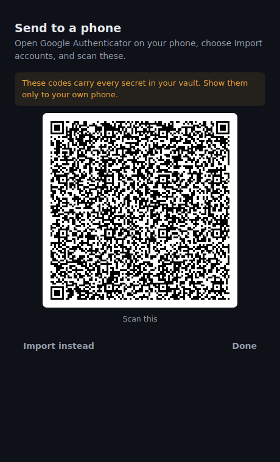
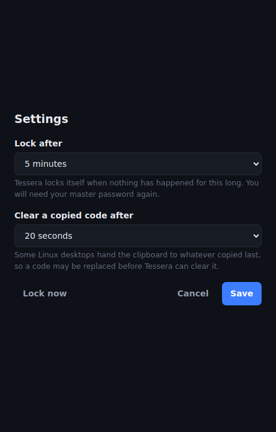
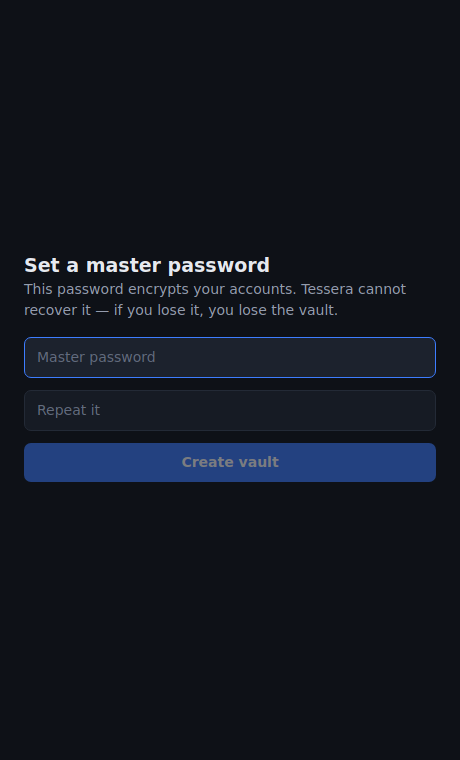

<div align="center">


# Tessera

**Open-source authenticator for Linux, Windows and macOS — your two-factor codes on the desktop, in an encrypted vault you hold the key to.**

Import the accounts you already have in Google Authenticator, generate TOTP and HOTP codes, and send them back to your phone whenever you need to.

[](./LICENSE)


Made with ❤️ by **[Privum Cloud »](https://privum.cloud)**

</div>

---

Tessera is a native desktop app for **two-factor authentication codes**, on Linux, Windows and macOS.
It keeps your accounts in a file encrypted with a master password only you know, generates the
six-digit codes you paste into login forms, and moves accounts to and from the Google
Authenticator app on your phone.

> **Windows is new in 0.3.1 and macOS in 0.5.0.** Both are built and packaged by CI on every
> release, and the code they are built from is the same code the Linux tests cover — but they
> have had far less running time than Linux has. If something is wrong there, an issue is welcome.

The name is Latin. A *tessera hospitalis* was the token a Roman carried to prove who he was —
one half of a tablet that only matched its counterpart. That is what a shared secret is.

## Screenshots

| Accounts in folders | Organising folders |
| :--: | :--: |
|  |  |
| **Import from Google Authenticator** | **Send accounts back to a phone** |
|  |  |
| **Settings, including where the vault lives** | **Set a master password** |
|  |  |

## Features

- **TOTP, HOTP and Steam** — SHA-1, SHA-256 and SHA-512, six to eight digits, any period.
  Verified against the published test vectors in RFC 6238 and RFC 4226.
- **Import from Google Authenticator** — read its export QR code from a screenshot, or paste
  the link behind it.
- **Export back to Google Authenticator** — Tessera writes the same format, so your phone can
  scan what it produces.
- **Add accounts by hand** — paste an `otpauth://` link or type the secret.
- **Encrypted at rest** — argon2id stretches your master password, AES-256-GCM seals the vault.
- **Locks itself** — after an idle period you choose, from a minute to a day, clearing
  the key from memory. Time the machine spends suspended counts towards it.
- **Clipboard that cleans up** — a copied code is cleared after a timeout you choose.
- **Folders** — nest them, give them icons, organise by client or however you work.
- **Search** — for when a handful of accounts becomes forty.
- **Share one vault between machines** — put it in a folder that already syncs
  and Tessera merges rather than overwrites, so neither machine loses an account
  the other added.
- **Keeps itself up to date** — it asks GitHub whether a newer release exists and offers to
  install it. You can turn that off.
- **No telemetry, no analytics, no accounts** — the update check is the only request Tessera
  ever makes, and it sends nothing about you.

## How it works

A TOTP secret is a fixed string of bytes. Combined with the current time it produces a
six-digit code that changes every thirty seconds. The important consequence:

> **Two apps holding the same secret produce identical codes forever, with nothing
> synchronising between them.**

That is why Tessera does not need to talk to your phone, or to a server, or to us. Once an
account is in both places, both show the same code at the same moment — offline, indefinitely.

Synchronisation only matters when you **add** or **remove** an account. Everything else is
arithmetic on a number you already have.

## Sharing one vault between machines

Settings → **Where the vault lives** → **Choose a folder**. Point it at anything
that already syncs — Drive, Nextcloud, Syncthing, a network mount — and your
machines share one vault.

Every machine needs the same master password, because the file is sealed with it.
Choosing a folder that already holds a vault opens that one rather than replacing
it, and choosing an empty folder puts a copy there and leaves the original where
it was.

Tessera **merges rather than overwrites**. When two machines both changed
something, the account with more edits behind it wins, an HOTP counter takes
whichever side is further ahead, and a deletion travels while a later edit still
beats it. Merging in either order reaches the same vault, which is what makes it
safe to have both machines running at once.

## Bringing your accounts over from Google Authenticator

Google Authenticator's cloud sync has **no public API**. No third-party application can read
it — not Tessera, not anyone. What the app does offer is an export, and that is the door
Tessera uses.

**On your phone:**

1. Open Google Authenticator.
2. Tap the menu, then **Transfer accounts → Export accounts**.
3. Confirm with your fingerprint or PIN, and choose the accounts to export.
4. It shows a QR code. With many accounts it shows several, labelled *1 of 2* and so on.
5. **Screenshot each one.** If your Android build blocks screenshots on that screen,
   photograph it with another camera — Tessera reads JPEGs too, though a screenshot decodes
   more reliably than a photo.
6. Get the images onto your computer, whichever way is quickest for you.

**In Tessera:**

1. Press **+**, then **Bring accounts over from Google Authenticator**.
2. Press **Choose an image** and pick the screenshot. Repeat for each QR code.

Tessera reports how many accounts it added. Importing the same file twice adds nothing the
second time — accounts are matched on their secret, not on an identifier, precisely because
people repeat an import when they are not sure it worked.

## Sending accounts back to your phone

Press **+ → Bring accounts over → Send to a phone instead**. Tessera renders your vault as
Google Authenticator migration QR codes, ten accounts per code. On the phone, choose
**Import accounts** in Google Authenticator and scan them.

Those codes carry every secret in your vault. Show them only to your own phone.

## Updates

Tessera asks GitHub whether a newer release exists when it starts, and tells you if there is
one. Nothing about you or your accounts goes with that request — it is a request for the
release list, the same one your browser would make. It is the only network request Tessera
makes, and **Settings → Check for updates** turns it off, after which it makes none at all.

If you accept an update, what happens next depends on how you installed it:

| Installed from | What updating does |
| --- | --- |
| `.AppImage` | Replaces the file and restarts. Nothing is asked of you. |
| Windows `.exe` | Runs the new installer over the top and restarts. |
| macOS `.dmg` | Replaces the app in place and restarts. Nothing is asked of you. |
| `.deb` / `.rpm` | Your system asks for an administrator password first, because your package manager owns those files. |

Every package is signed, and Tessera checks that signature against a key built into it before
installing anything. An update it cannot verify is refused.

Two honest notes. **The first version you install has to be installed by hand** — the machinery
that updates Tessera has to already be inside it, so anything installed before this feature
existed cannot pull itself forward. And on `.deb`/`.rpm` the update runs `dpkg`/`rpm` directly,
which does not resolve dependencies the way `apt` does; if a release ever changes what Tessera
links against, that update will fail and tell you, and installing the new package with `apt`
will fix it.

## Install

Grab a package from the [latest release](../../releases/latest).

### Debian / Ubuntu (`.deb`)

```bash
sudo apt install ./Tessera_0.3.1_amd64.deb
```

`apt` rather than `dpkg -i`, so the WebKit and GTK dependencies resolve.

### Fedora / RHEL / openSUSE (`.rpm`)

```bash
sudo dnf install ./Tessera-0.3.1-1.x86_64.rpm
```

### Windows (`.exe`)

Run the installer. Windows 11 already has the WebView2 runtime Tessera draws through;
on Windows 10 the installer fetches it if it is missing.

### macOS (`.dmg`)

Open the disk image and drag Tessera into Applications. It runs on macOS 11 or later, on
both Apple Silicon and Intel — one download covers both.

**The first launch needs one extra click.** Tessera is not signed with an Apple Developer
ID, so macOS will say it cannot verify the developer (or, on recent versions, that the app
"is damaged" — it is not). Go to **System Settings → Privacy & Security**, scroll down, and
choose **Open Anyway**; you are asked once and never again. If you prefer the terminal:

```bash
xattr -d com.apple.quarantine /Applications/Tessera.app
```

This is the same warning Windows shows for the unsigned installer. Nothing about the app is
different; what is missing is a yearly fee to Apple.

### Any Linux (`.AppImage`)

No installation, no root:

```bash
chmod +x Tessera_0.3.1_amd64.AppImage
./Tessera_0.3.1_amd64.AppImage
```

### Build from source

You need Node 20. The Rust toolchain is pinned in `rust-toolchain.toml`, so `rustup` fetches
the right one for you.

On Linux, install what Tauri links against first:

```bash
sudo apt install libwebkit2gtk-4.1-dev libgtk-3-dev librsvg2-dev \
  libayatana-appindicator3-dev patchelf
```

On Windows you need the Microsoft C++ build tools and the WebView2 runtime, both of which
[Tauri's prerequisites page](https://tauri.app/start/prerequisites/) walks through.

On macOS, `xcode-select --install` is enough.

Then, on any of them:

```bash
git clone https://github.com/privum-cloud/tessera-mfa-app.git
cd tessera-mfa-app
npm install

npm run tauri build -- --bundles deb     # Linux
npm run tauri build -- --bundles nsis    # Windows
npm run tauri build -- --bundles dmg     # macOS

# or run it live during development:
npm run tauri dev
```

## Security

**Your master password is the only key.** It is stretched with argon2id at the OWASP profile
and never leaves your machine. Tessera cannot recover it — if you lose it, you lose the vault.

**It is asked for at every launch.** There is no OS keyring integration, deliberately: the
derived key never touches disk, at the cost of typing a password each session.

**The vault file is `0600`** in `~/.local/share/tessera/` on Linux and
`~/Library/Application Support/tessera/` on macOS, in a `0700` directory. Writes go to
a temporary file and are renamed into place, so an interrupted save cannot leave a vault that
is neither the old one nor the new one.

**On Windows the vault is in `%LOCALAPPDATA%`**, not the roaming `%APPDATA%` — a roaming
profile is copied to a domain server at sign-out, and a file of second factors should not
travel to one unasked. That folder is created with an access control list granting only the
owner, SYSTEM and administrators. Note the difference from Linux: Tessera *inherits* that
rather than setting it, and a vault moved to a shared folder takes the folder's permissions
instead. Explicit Windows ACLs are not implemented yet.

**The interface never sees a secret.** The Rust core returns generated codes and account names;
there is no field on that boundary for a shared secret, and a test asserts it on the serialised
form rather than trusting the type.

**A caveat worth stating plainly:** keeping your TOTP secrets on the same machine as your
browser weakens the premise of a second factor — one compromised machine yields both. That is
a real trade-off people make for convenience, and you should make it knowingly.

## Architecture

| | |
| --- | --- |
| **Shell** | [Tauri 2](https://tauri.app) — a native window around a small Rust core |
| **Core** | Rust: code generation, encryption, vault storage, import and export |
| **Interface** | React 19, TypeScript, Vite |
| **Crypto** | `argon2`, `aes-gcm`, `zeroize` |
| **Codes** | `hmac`, `sha1`, `sha2`, `base32` |
| **QR** | `rqrr` to read, `qrcode` to write, `image` for file formats |

Everything security-relevant lives in Rust. The interface is a renderer.

## Prior art, honestly

[Ente Auth](https://ente.io/auth/) and [GNOME Authenticator](https://apps.gnome.org/Authenticator/)
already run on Linux, and both are good. Tessera is not the first authenticator for the
platform and does not claim to be. What it offers is a direct, two-way road to Google
Authenticator and an interface built for the way you actually use one of these: open it, find
the row, copy the code, get out.

## Contributing & feedback

Issues and pull requests are welcome. If you hit a bug, the most useful report includes what
you did, what happened, and the exact message Tessera showed you.

## License

GPL-3.0-only. See [LICENSE](./LICENSE).

---

<div align="center">

Built by **[Privum Cloud »](https://privum.cloud)**

</div>
